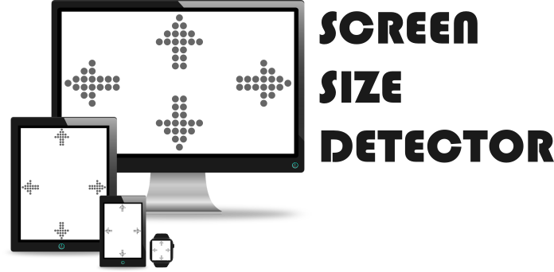

# screen-size-detector


## Table of Contents

- [Introduction](#introduction)
- [Features](#features)
- [Install](#install)
- [Usage](#usage)
- [Initialisation](#initialisation)
- [Options](#options)
- [Properties](#properties)
- [Methods](#methods)
- [Issues, Questions and Suggestions](#issues-questions-and-suggestions)
- [License](#License)


### Introduction

**screen-size-detector** is a small utility to detect screen (viewport) size (resolution height and width) and listener to resize event with additional features. You may think of it as some sort of JavaScript media query (amont other things) in at its core.


### Features

- Easy current screen width and height getters. For example:  `screen.width` and `screen.height`

- Predefined [screen width detections](#default options), for example  `screen.is.mobile`, `screen.is.laptop`, etc. 

- You may specify (functions) callback to be triggered on screen width change, screen height change and screen width and height change (3 different callbacks support)

- You may overwrite the predefined screen width configurations, and you may add your own screen width definitions and configurations, at instance creation or at any time by using the available methods, as much as you want

- You may set and/or remove 3 different callbacks (all optional) to be executed for when the current screen width: 

  - **enters** 
  - **is inside**
  - **leaves** 

  the defined screen width range (min and max), of any defined screen width.

- You can specify a (function) callback to be executed after the usage completion of all available methods:

  - setMainCallback
  - removeMainCallback
  - addWidthDefinitions
  - removeWidthDefinition
  - setWidthCategoryCallback
  - removeWidthCategoryCallback
  
- You may modify the configurations and definitions of the instance at any time after initialisation

- No external dependencies and lightweight

  

### Install

**Using NPM**:

```bash
npm install --save screen-size-detector
```

**Using Yarn**:

```bash
yarn add screen-size-detector
```


**In browser**:

​	**Using CDN**:

```html
<script src="https://unpkg.com/screen-size-detector@latest/dist/screen-size-detector.min.js"></script>
```

​	**Using local file**:

```html
<script src="./dist/screen-size-detector.min.js"></script>
```


### Usage

The most basic usage example (In Node.js):

```js
const ScreenSizeDetector = require('screen-size-detector');
// or
//import ScreenSizeDetector from 'screen-size-detector';

const screen = new ScreenSizeDetector(); // Default options
console.log(screen.width); // Then use screen anywhere in your project
```

The most basic usage example (In browser):

```html
<script src="https://unpkg.com/screen-size-detector@latest/dist/screen-size-detector.min.js"></script>

<script>
const screen = new ScreenSizeDetector(); // Default options
console.log(screen.width); // Then use screen anywhere in your project   
</script>
```


### Initialisation

As shown above, to use screen-size-detector, you just have to initialise an instance, with an optional argument of options object:

```javascript
const screen = new ScreenSizeDetector(/*options object goes here. Optional.*/);
```


### Options

The default options used if no options is supplied are as follows:

```javascript
const defaultOptions = {
  onHeightChange: () => {}, // OPTIONAL: A callback to trigger on screen height change
  onWidthChange: () => {}, // OPTIONAL: A callback to trigger on screen width change
  onBothChange: () => {}, // OPTIONAL: A callback to trigger on screen width and height change
  widthDefinitions: { // Width definitions object. Can be overwritten, added or removed
    smartwatch: {
      min: 0,
      max: 319,
      inclusion: "[]",
    }, 
    mobile: {
      min: 320,
      max: 480,
      inclusion: "[]",
    },
    tablet: { // Width category name. Will appear on <instance>.is.<width category name> Ex: screen.is.tablet which will return true or false
      min: 481, // Minimum screen width in pixel for this category
      max: 768, // Maximum screen width in pixel for this category 
      inclusion: "[]", // "inclusion" will only accept the combination of either '[]', '[)', '(]' or '()'. '[' means include the min value, '(' means exclude the min value, ']' means include the max value and ')' means exclude the max value.
        
        /* For the example of this 'tablet' category, this is what it means for the inclusion:
        	If '[]' is provided: Range for smartwatch is defined is 481 px - 768 px
        	If '[)' is provided: Range for smartwatch is defined is 481 px - 767 px
        	If '(]' is provided: Range for smartwatch is defined is 480 px - 768 px
        	If '()' is provided: Range for smartwatch is defined is 480 px - 767 px
        */
        onEnter: () => {}, // OPTIONAL: A callback that will be triggered once screen width enters this width range (481px - 768px)
        whileInside: () => {}, // OPTIONAL: A callback that will be triggered while screen width changes within this width range (481px - 768px)
        onLeave: () => {}, // OPTIONAL: A callback that will be triggered once screen width leaves this range (481px - 768px)
    },
    laptop: {
      min: 769,
      max: 1024,
      inclusion: "[]",
    },
    desktop: {
      min: 1025,
      max: 1200,
      inclusion: "[]",
    },
    largedesktop: {
      min: 1201,
      max: Infinity,
      inclusion: "[]",
    },
  },
};

// Use it like so:
const screen = new ScreenSizeDetector(defaultOptions); // same as const screen = new ScreenSizeDetector(); since the above are the default options.
```


### Properties

- **width**

  - Description: The current width of the screen in pixels

  - Example:

  - ```javascript
    console.log(`The current screen width is ${screen.width}`);
    ```


- **height**

  - Description: The current height of the screen in pixels

  - Example:

  - ```javascript
    console.log(`The current screen height is ${screen.height}`);
    ```

  

- **is.`<widthCategoryName>`**

  - Description: A boolean of whether the current screen width is within the specified `widthCategoryName` configuration inside the `widthDefinitions` [option](#options)

  - Example:

  - ```javascript
    console.log(`The current screen width in mobile category: ${screen.is.mobile}`);
    ```
    


### Methods

Here are the available methods on the initialised object:


- **setMainCallback (when, callback[, onDone])**

  - Description: A method to set callback to be executed. Available events are on width change, height change and both width and height change

  - `when` <String> | When to trigger the callback. The options are **`widthchange`**, **`heightchange`** and **`bothchange`** (required)

  - callback <Function> | The callback to be triggered when the condition is met (required) 

  - `onDone` <Function> | A callback (optional)

  - Example:

  - ```javascript
    const input = document.querySelector('input');
    input.value = screen.width;
    screen.setMainCallback('widthchange', () => input.value = screen.width); // Reactive
    ```
  


- **removeMainCallback (widthCategoryName, when[, onDone])**

  - Description: A method to remove callback for events of width change, height change or both width and height change

  - `when` <String> | The event where the callback to be removed. The options are **`widthchange`**, **`heightchange`** and **`bothchange`** (required)

  - `onDone` <Function> | A callback (optional)

  - Example:

  - ```javascript
    const onDone = () => {
        console.log ('Done removing width change callback');
    }
    
    screen.removeMainCallback('widthchange', onDone);
    ```


- **addWidthDefinitions (widthDefinitionObject[, onDone])**

  - Description: A method to add width definition to the instance

  - `widthDefinitionObject` <Object> | Width definition object, the structure is the same as [Options](#options) (***defaultOptions***) object above (required) 

  - `onDone` <Function> | A callback (optional)

  - Example: 

  - ```javascript
    const widthDefinitionObject = {
        laptopandsmaller: {
          min: 0,
          max: 1024,
          inclusion: "[]",
        },
        largerthanlaptops: {
          min: 1025,
          max: Infinity,
          inclusion: "[]",
        },
    };
    
    const onDone = () => {
        console.log(`Done adding. Is my screen width laptop and smaller: ${screen.is.laptopandsmaller}`);
    };
    
    screen.addWidthDefinitions(widthDefinitionObject, onDone);
    ```


- **removeWidthDefinition (widthCategoryName[, onDone])**

  - Description: A method to remove width definition from the instance

  - `widthCategoryName` <String> | Width category name (required)

  - `onDone` <Function> | A callback (optional) 

  - Example: 
  
  - ```javascript
    const onDone = () => {
        console.log(`Done removing. My current screen width is: ${screen.width}px`);
    };
    
    screen.removeWidthDefinition('smartwatch', onDone);
    ```


- **setWidthCategoryCallback (widthCategoryName, when, callback[, onDone])**

  - Description: A method to set the callback to be triggered whether the width range has been entered, is inside or exited

  - `widthCategoryName` <String> | Width category name (required)

  - `when` <String> | When to trigger the callback. The options are **`enter`**, **`whenInside`** and **`leave`** (required)

  - callback <Function> | The callback to be triggered when the condition is met (required) 

  - `onDone` <Function> | A callback (optional)

  - Example:
  
  - ```javascript
    const applyMobileClass = () => {
        const listItems = document.querySelectorAll(".main-container li");
        const mobileClass = 'in-mobile';
    
        listItems.forEach(el => {
            el.classList.add(mobileClass);
        });
    }
  
    const removeMobileClass = () => {
        const listItems = document.querySelectorAll(".main-container li");
        const mobileClass = 'in-mobile';
    
        listItems.forEach(el => {
            el.classList.remove(mobileClass);
        });
    }
    
    const onDone = () => {
        console.log ('Done setting callback');
    }
    
    screen.setWidthCategoryCallback('mobile', 'enter', applyMobileClass, onDone);
    screen.setWidthCategoryCallback('mobile', 'leave', removeMobileClass, onDone);
    ```
  
    


- **removeWidthCategoryCallback (widthCategoryName, when[, onDone])**

  - Description: A method to remove width category callback from the instance

  - `widthCategoryName` <String> | Width category name (required)

  - `when` <String> | The event  where the callback to be removed. The options are **`enter`**, **`whenInside`** and **`leave`** (required)

  - `onDone` <Function> | A callback (optional)

  - Example:
  
  - ```javascript
    const onDone = () => {
        console.log ('Done removing mobile enter callback');
    }
    
    screen.removeWidthCategoryCallback('mobile', 'enter', onDone);
    ```
  


### Issues, Questions and Suggestions

Have any issues, questions or suggestions? You are very welcomed to head over to the [Issues page](https://github.com/devfakhzan/screen-size-detector/issues) and let's see what we can do to make this small utility better


### License

[MIT](License)
